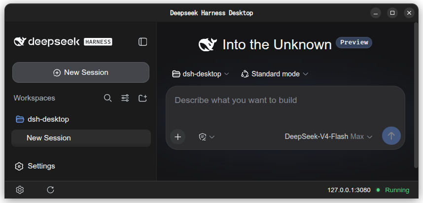
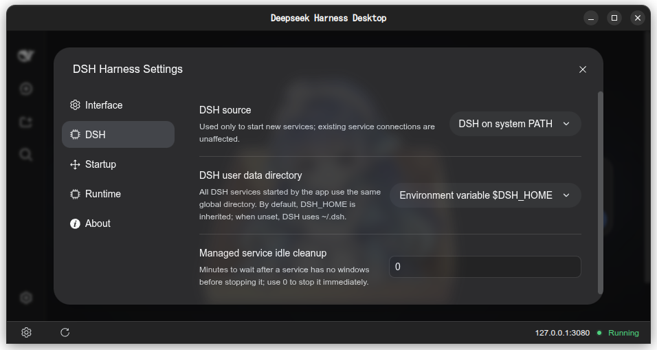
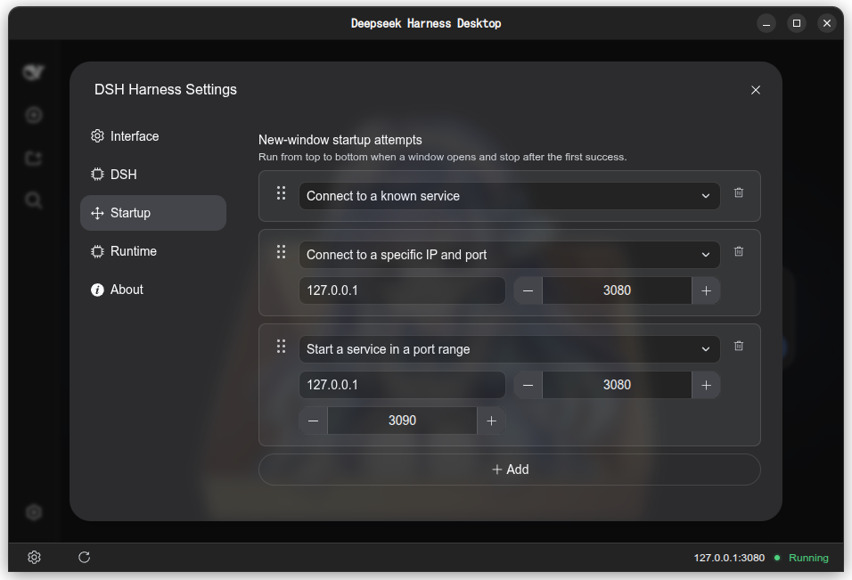
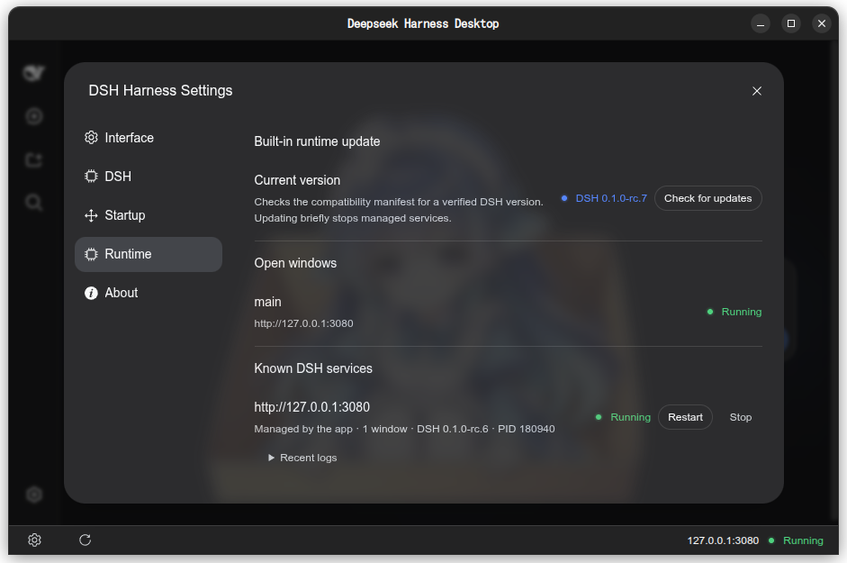

| [中文](README.md) | English |
| ----------------- | ------- |

<div align="center">

# DSH Desktop

A lightweight cross-platform desktop wrapper for [DeepSeek Harness (DSH)](https://github.com/deepseek-ai/deepseek-harness), offering a graphical interface and flexible runtime management.

[](https://github.com/Leawind/dsh-desktop/releases)

[](https://github.com/Leawind/dsh-desktop/actions/workflows/ci.yml?query=branch%3Amain)
[](https://github.com/Leawind/dsh-desktop/blob/main/LICENSE)

  
</div>

## Why This?

- **Cross‑platform** — Provides installers and portable packages for Windows, Linux, and macOS.
- **Lightweight distribution** — The `slim` variant is only ~7–10 MB, ideal if you already have a DSH environment or only need to connect to a remote service.
- **Flexible DSH sources** — Choose from bundled runtime, system `dsh`, custom path, npx launcher, or direct connection to an existing DSH service.

## Variants

| Use Case                                                    | Recommended Variant | Size       | Notes                                   |
| ----------------------------------------------------------- | ------------------- | ---------- | --------------------------------------- |
| Out‑of‑the‑box, supports both bundled and external DSH      | `bundled`           | 100–120 MB | Includes DSH runtime                    |
| You already have DSH installed, no need for bundled runtime | `slim`              | 7–10 MB    | All features except the bundled runtime |

## Installation & First Run

Download the appropriate release file for your platform and variant from [Releases](https://github.com/Leawind/dsh-desktop/releases).

**Portable data directory**: After the first run, the app creates a `data/` folder alongside the executable, storing settings, single‑instance lock, embedded resources, and the bundled runtime. You can move the entire directory to carry this data. Note that the actual DSH Home content, browser cache, and external paths you specify in settings are not migrated along with the directory.

### Linux Runtime Dependencies

Linux (DEB and portable) requires system GTK 3 and xdotool, plus a supported graphical browser. On Debian/Ubuntu:

```bash
sudo apt install libgtk-3-0 libxdo3
```

APT handles indirect dependencies (GTK, GDK, GLib, Cairo, X11/Wayland) automatically. If no compatible system browser is available, the app will attempt to use the system WebView; if neither works, the UI will not display.

## DSH Launch Methods

You can run DSH in any of the following ways:

- **Bundled runtime** (only in `bundled` variant) — no need for Node.js, npm, or pnpm.
- **`dsh` from system PATH** — install globally via npm first:
  ```bash
  npm i -g @deepseek-ai/dsh
  ```
- **Custom executable or script** — manually specify the DSH launcher path.
- **npx launcher** — requires Node.js; automatically downloads the specified DSH version on first run.
- **Connect to an existing DSH web service** — enter the service URL directly; no local process is started.

The `bundled` variant uses the bundled runtime by default but supports all other methods as well. The `slim` variant does not include a bundled runtime, but all other methods work.

## UI Overview

<div align="center">



Choose your DSH source and centrally configure the DSH Home path for managed services

<br>


Define startup behavior

<br>


View and manage the bundled runtime

<br>
</div>

> [!TIP]
>
> For detailed installation and configuration of DeepSeek Harness, refer to the [official documentation](https://github.com/deepseek-ai/deepseek-harness/blob/master/README.md).

> [!IMPORTANT]
> This project is community‑developed, not an official DeepSeek project, and is not endorsed by or affiliated with DeepSeek.
