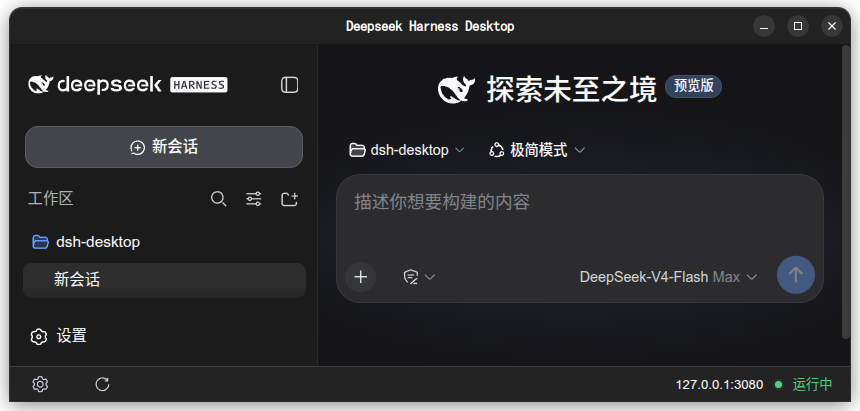
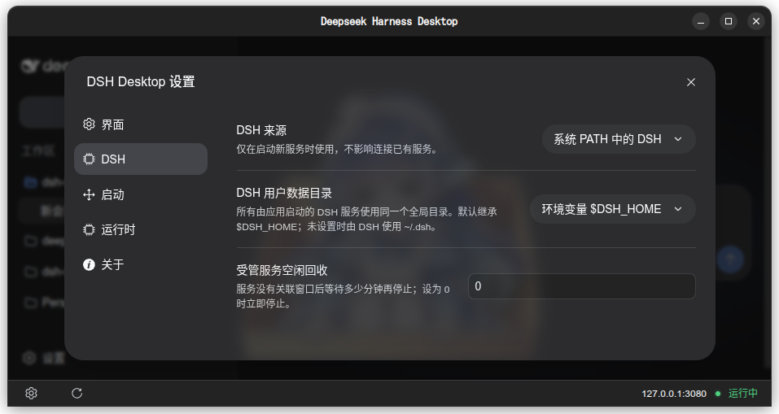
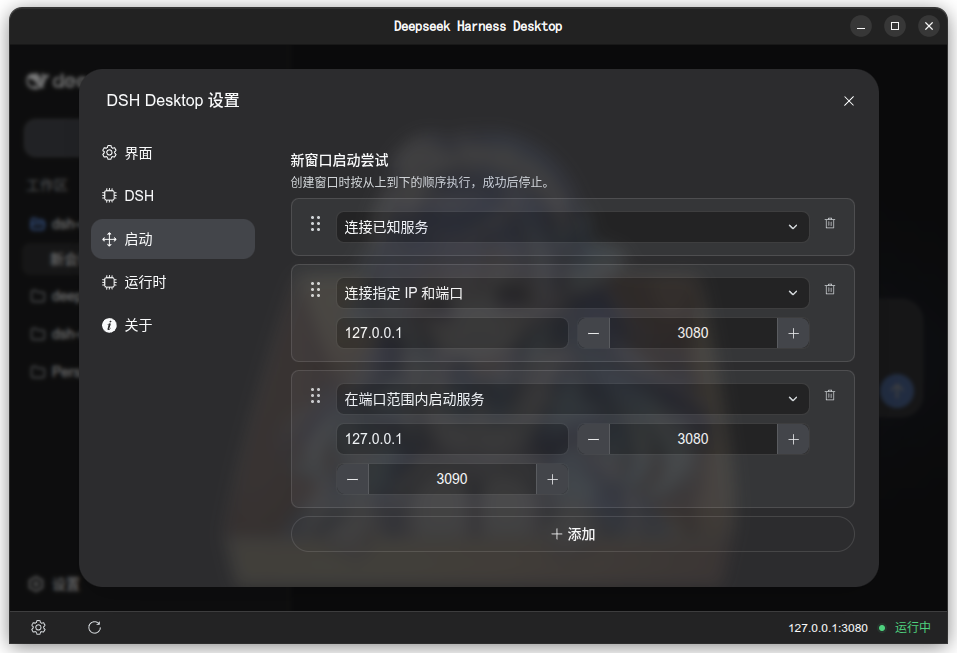
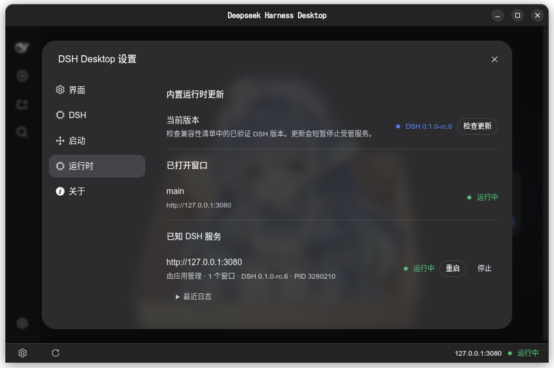

| 中文 | [English](README.en.md) |
| ---- | ----------------------- |

<div align="center">

# DSH Desktop

[DeepSeek Harness (DSH)](https://github.com/deepseek-ai/deepseek-harness) 的轻量级跨平台桌面封装，提供图形化界面与灵活的运行环境管理。

[](https://github.com/Leawind/dsh-desktop/releases)

[](https://github.com/Leawind/dsh-desktop/actions/workflows/ci.yml?query=branch%3Amain)
[](https://github.com/Leawind/dsh-desktop/blob/main/LICENSE)

  
</div>

## 为什么选择它

- **跨平台支持** — 提供 Windows、Linux、macOS 的安装包及便携版本。
- **轻量分发** — `slim` 变体仅约 7–10 MB，适用于已有 DSH 环境或仅需连接远程服务的场景。
- **灵活的 DSH 来源** — 可选择内置运行时、系统 `dsh`、自定义路径、npx 启动，或直接连接已有 DSH 服务。

## 版本选择

| 使用场景                             | 推荐变体  | 包大小     | 说明                         |
| ------------------------------------ | --------- | ---------- | ---------------------------- |
| 开箱即用，希望同时支持内置和外部 DSH | `bundled` | 100–120 MB | 内置 DSH                     |
| 已自行安装 DSH，无需内置运行时       | `slim`    | 7–10 MB    | 保留除内置运行时外的全部能力 |

## 安装与首次运行

请从 [Releases](https://github.com/Leawind/dsh-desktop/releases) 下载对应平台和变体的发行文件：

**便携版数据目录**：首次运行后，应用会在同级目录下创建 `data/` 文件夹，用于存放设置、单实例锁、嵌入资源和内置运行时。迁移整个目录即可携带这些数据。请注意，DSH Home 的实际内容、浏览器缓存以及用户在设置中指定的外部路径不会随目录迁移。

### Linux 运行时依赖

Linux（DEB 和便携版）依赖系统 GTK 3 和 xdotool，并需要一个受支持的图形浏览器。Debian/Ubuntu 可通过以下命令安装：

```bash
sudo apt install libgtk-3-0 libxdo3
```

APT 会自动处理 GTK、GDK、GLib、Cairo、X11/Wayland 等间接依赖。若无可用的系统浏览器，应用会尝试使用系统 WebView；两者均不可用时将无法显示界面。

## DSH 启动方式

您可以选择以下任一方式运行 DSH：

- **内置运行时**（仅 `bundled` 变体） — 无需额外安装 Node.js、npm 或 pnpm。
- **系统 PATH 中的 `dsh`** — 需提前通过 npm 全局安装：
  ```bash
  npm i -g @deepseek-ai/dsh
  ```
- **自定义可执行文件或脚本** — 手动指定 DSH 启动文件路径。
- **npx 启动** — 需安装 Node.js，首次运行时会自动下载指定的 DSH 版本。
- **连接已有 DSH Web 服务** — 直接输入服务地址，不启动本地进程。

`bundled` 默认使用内置运行时，同时支持其余所有方式；`slim` 不含内置运行时，但其他方式均可使用。

## 界面速览

<div align="center">



选择 DSH 来源，并统一配置受管服务的 DSH Home 路径

<br>


定义启动窗口时的行为

<br>


查看和管理内置运行时

<br>
</div>

> [!TIP]
>
> DeepSeek Harness 的具体安装与配置以[官方文档](https://github.com/deepseek-ai/deepseek-harness/blob/master/README.zh.md)为准。

> [!IMPORTANT]
> 本项目由社区开发，非 DeepSeek 官方项目，也未获得 DeepSeek 的官方认可或背书。
